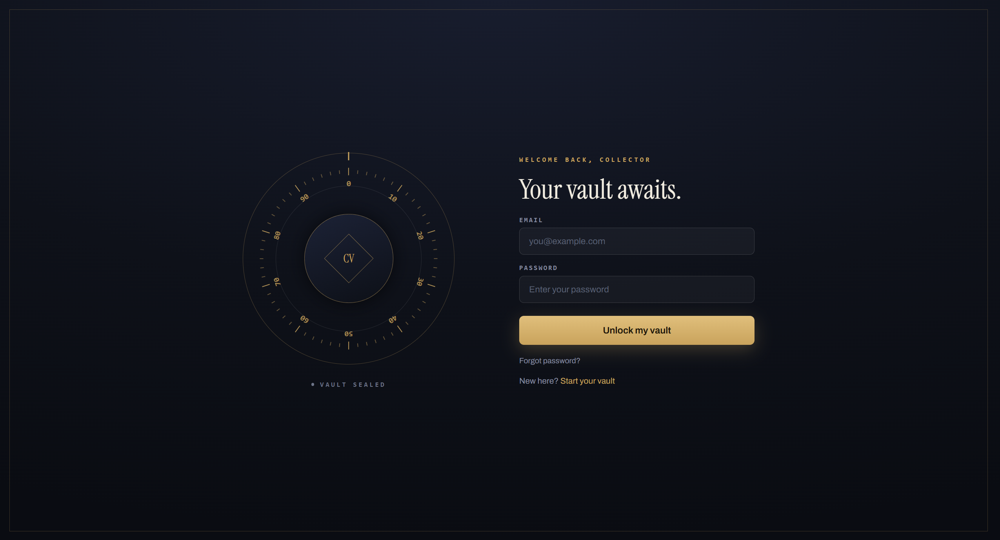
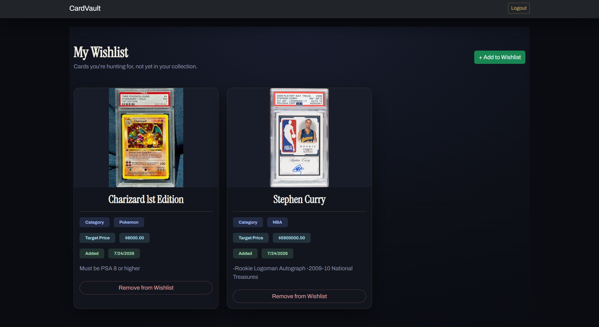

# CardVault 🃏

**A centralized web application for trading-card collectors — catalogue the cards you own,
track the cards you want, and connect with the community through organised meetups.**

C237 Software Application Development — CA2, Team 4.

🔗 **Live demo:** https://cardvault-io9j.onrender.com

---

## What is CardVault?

Collectors of trading cards (Pokémon, One Piece, NBA, football and more) usually track their
collection in scattered spreadsheets or photos. CardVault brings the whole hobby into one place,
following the natural journey of a collector:

- **Own** — catalogue the cards you already have, with value, condition and images.
- **Want** — keep a private wishlist of the "grail" cards you're still hunting for.
- **Connect** — see the schedule of community meetups to trade with other collectors in person.

---

## Features

### 👤 Accounts & Access Control
- Register, log in, and reset a forgotten password.
- **Two roles** — regular **members** and **admins** — enforced by route middleware.
- Members manage their own data; admins manage the community and other users.

### 🗂️ Card Collection (full CRUD)
- Add, view, edit and delete cards, each with an image, value, condition and rarity.
- **Search and filter** the collection by name, category and rarity.

### ⭐ Wishlist (private)
- A per-user list of cards you want but don't own yet — visible only to you.
- Add and remove wishlist entries, each with a target price and notes.

### 📅 Community Meetups
- Admins schedule community meetups (date, time, location).
- Members view **upcoming** meetups; past events drop off the list automatically.
- Full admin CRUD (add / edit / delete) with a confirmation step on delete.

### 🛠️ Admin Dashboard
- View all registered users and system statistics.
- Inspect any member's collection and promote/demote user roles.

---

## Screenshots

### Login


### Card Collection Dashboard


### Wishlist


### Community Meetups


### Admin Dashboard


---

## Tech Stack

| Layer | Technology |
|---|---|
| Runtime | Node.js |
| Framework | Express |
| Views | EJS templates + Bootstrap 5 |
| Database | MySQL (hosted on Azure) |
| Auth | express-session, connect-flash, SHA1 password hashing |
| Uploads | multer |
| Hosting | Render |

---

## Team — Group 4

| Member | Student ID |
|---|---|
| Tan Boon Meng | 25052694 |
| Mok Zhan Fung | 25046126 |
| Rainie Ng Yi Yuan | 25023092 |
| Lee Huang Xiang Ryan | 25052448 |
| Koh Yu Jin Ezann | 25013180 |
| Teng Ee Kar Sammi | 24029891 |

---

## Running Locally

```bash
npm install      # install dependencies
node app.js      # start the server → http://localhost:3000
```

The MySQL connection details are configured in `app.js`. Requires Node.js installed.
